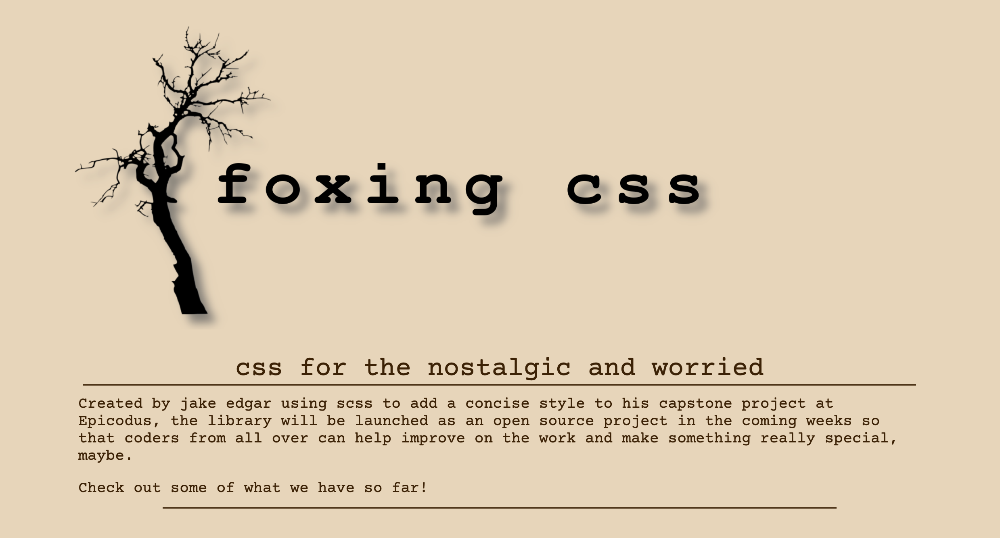

## **f o x i n g &nbsp; &nbsp; c s s**

- A custom CSS library built for aesthetically stubborn users obsessed with nostalgia.
- by: [Jakeedgar](https://github.com/jakeedgar)

 

 

## Description

- I designed this css library with the hopes of opening it up to the open source community and building something a bit niche, but valuable and effective. The library is a utility driven library with
  a very robust set of features from in class padding control to custom checkboxes and more. The current `index.html` file is a basic static site with a variety of the components displayed for the
  user to view.

## Technology Used

 

 

## Installation Instructions

- Navigate to your preferred code editing software. I recommend VSCode.
- Clone this repository to your desktop by using the command _git clone_ followed by this link `https://github.com/jakeedgar/foxingcss.git`
- Navigate to the top level of the directory.
- Ensure Node is install by running with the command `NPM -v` in your terminal, and if it is not use your preferred installer to install Node.
- Run `NPM install` to install dependencies.
- At this point you can use the project by building out an HTML file that implements the class names provided by the SCSS files.
- Run `NPM run gulp` to run the sass compiler, and monitor changes to your HTML in the browser.

## Known Bugs

- The package has not yet been launched so installation is not fully functional yet.
- The checkbox does not dynamically display the "not allowed" cursor.
- The form inputs rely on padding to change sizing which negatively effects layout.

## License

Licensed under the [MIT License](LICENSE). Copyright (c) 2022 Jake Edgar.
